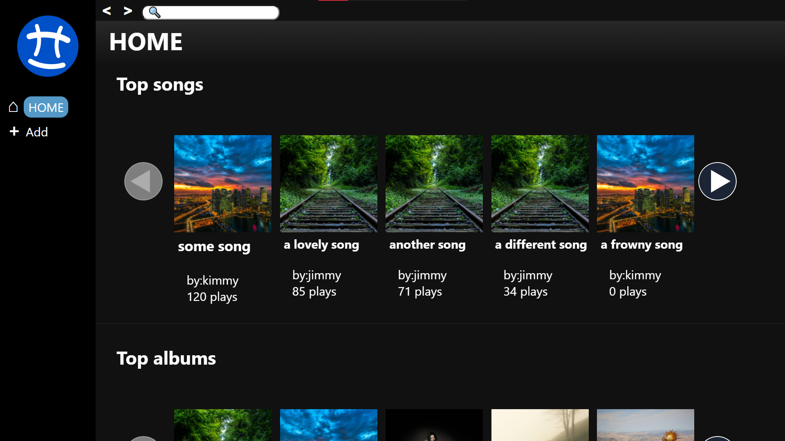
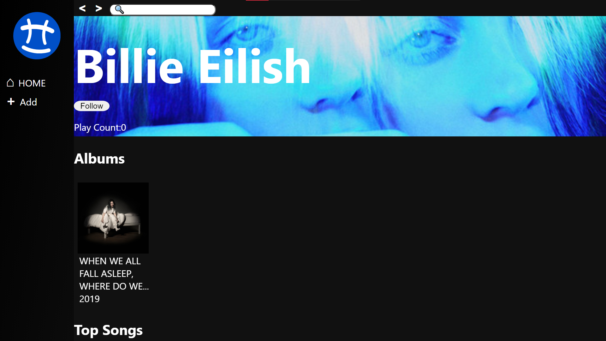
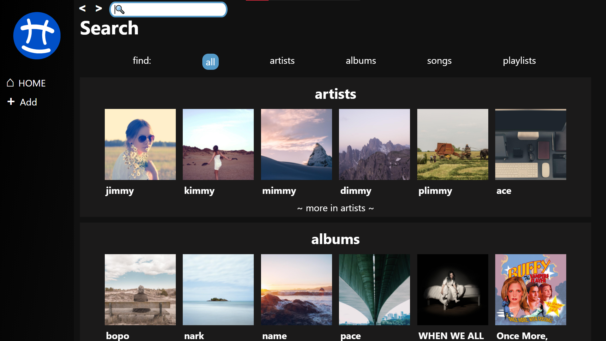
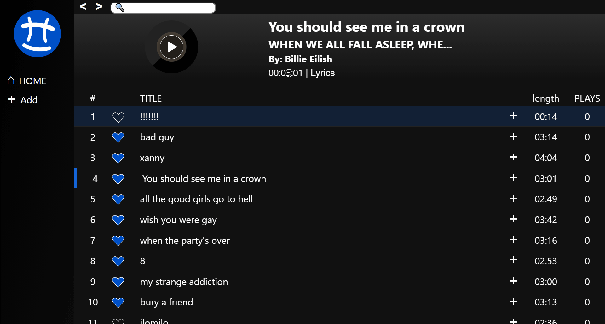

#  Spopify

Enjoy music with Spopify!

Full Stack Project:
- React
- MySQL, NodeJS, ElasticSearch on cloud

[Diagram](https://drawsql.app/cyber4s-3/diagrams/spopify-updaterd) on DrawSQL  
[sql Data](sql/DB_spopify.sql)  

## setup
1. Clone to your machine, and `cd` into the folder
1. `npm install` to install the dependencies.
1. Requires a MySQL server to function properly, structure and data dump [provided](sql/DB_spopify.sqls)
2. Add a `.env` file or edit the provided [example](example.env)
1. `npm start` to start the server (default port **8080**). The client will be served through the server on [`localhost:8080/`](http://localhost:8080/)
1. The app runs without Elastic, as it falls back to the SQL search. 
* to Use Elastic Search, first add your credentials to the .env. then you should run the migration paths in `/elastic/migrate` to migrate the data for searching. It does not move everything, only whats important for the search.

## interesting features:

- Animations!
- Uses Spotify widgets, so if you are logged in on the browser yu can listen to the full songs.
- Debounced search
- Search using Elastic for faster results.
- Local top charts
- Discover fake artists! 

## Disclaimer
this Project is not affiliated nor is it claiming to provide any sort of alternative to any music service.